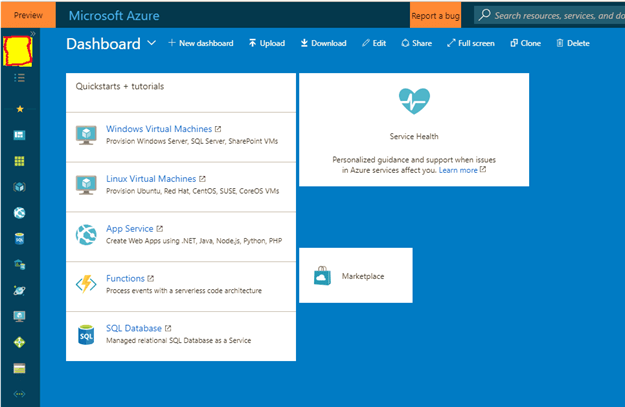




## **ABAP SDK Implementation guide for Azure Event hubs**

[Git Hub](https://github.com/Microsoft/ABAP-SDK-for-Azure)

*Author: Microsoft SAP Team*.

*Version: 1.0*


#### ABAP SDK for Azure
**Contents**  

1. What is Azure Event hub?  
2. Prerequisites  
3. How to setup Event hub in Azure?  
4. How to send data from SAP to Azure Event hub?  
 * Creation of RFC destination to Azure Event hub  
 * STRUST Setup
 * Configuration  
   * ZREST_CONFIG
   * ZREST_CONF_MISC
   * ZADF_CONFIG 
   * ZADF_EHUB_POLICY 
   * DEMO Program  
   
 5. View sent data in Azure Eventhub  
 6. ABAP SDK Monitor  
 7. Auto re-processing of failed messages  
 
 
 
 ## What is Azure Event hub? :scream:
 **Stream millions of events per second** 
 
 Azure Event Hubs is a hyper-scale telemetry ingestion service which collects, transforms and stores millions of events. As a distributed streaming platform, it gives you low latency and configurable time retention, which enables you to ingress massive amounts of telemetry into the cloud and read the data from multiple applications using publish-subscribe semantics.  
 For more details on Azure Event hubs, visit [Microsoft Azure Event hub](https://azure.microsoft.com/en-in/services/event-hubs/) 

 ## Prerequisites

 Make sure you have installed ABAP SDK for Azure in your SAP system. Refer document ‘ABAP SDK for Azure – Github’ for more details.
 
 ## How to setup Event hub in Azure?  
 Login to [Microsoft Azure portal](https://ms.portal.azure.com/#home)
 
 > **Note**:If you do not have an account already. please create a new [Azure account](https://azure.microsoft.com/en-us/). You can start free Once you are logged into portal, chose push button ‘+’ on the left to create a new Azure service.
 ```markdown
 
 ```
  